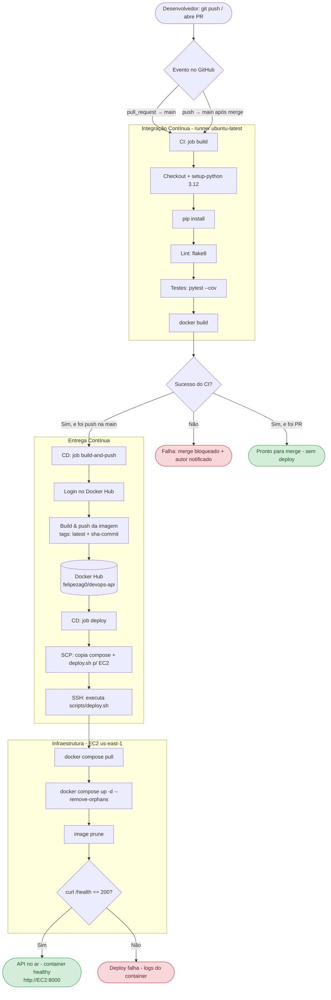
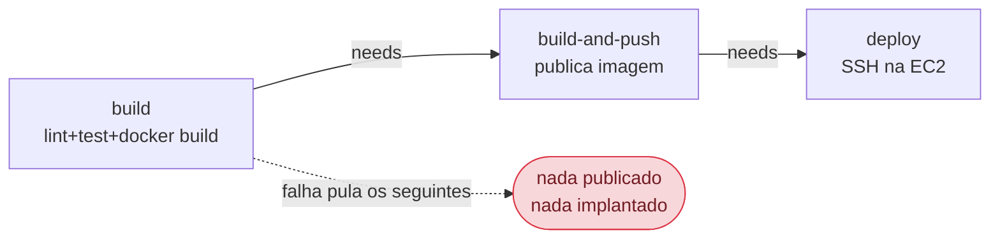

# Fluxograma CI/CD ponta a ponta (EAP 4.2.1.1 — Seção 3b)

Representa o fluxo completo do projeto **devops-api**: do commit do desenvolvedor
até a aplicação em execução na EC2. **Item obrigatório para a nota máxima de C3.**

> **Como gerar a imagem para o template:** o diagrama abaixo está em
> [Mermaid](https://mermaid.js.org). Para exportar como PNG/SVG:
> - cole o bloco `mermaid` em https://mermaid.live e clique em *Download* (PNG/SVG), ou
> - no VS Code use a extensão *Markdown Preview Mermaid Support* e exporte, ou
> - `npx @mermaid-js/mermaid-cli -i docs/fluxograma-cicd.md -o fluxograma.png`.
> Inserir a imagem resultante na Seção 3b do template.

## Fluxograma principal (commit → app no ar)

## Encadeamento dos jobs (needs / fail-fast)

## Legenda das etapas

| Fase | Onde | O que acontece |
|---|---|---|
| Commit | Local / GitHub | `git push` ou abertura de PR para `main` |
| CI | Runner GitHub | lint (flake8) → testes (pytest) → docker build |
| CD - build-push | Runner GitHub | login + build + push da imagem (latest + sha) |
| CD - deploy | Runner → EC2 | SCP do compose/script + SSH executando `deploy.sh` |
| Infra | EC2 us-east-1 | `compose pull` + `up -d` + prune + valida `/health` |
| App | EC2:8000 | API FastAPI em execução, container healthy |
